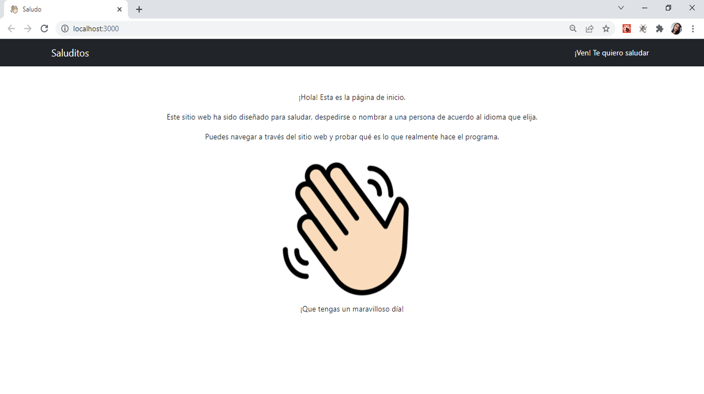
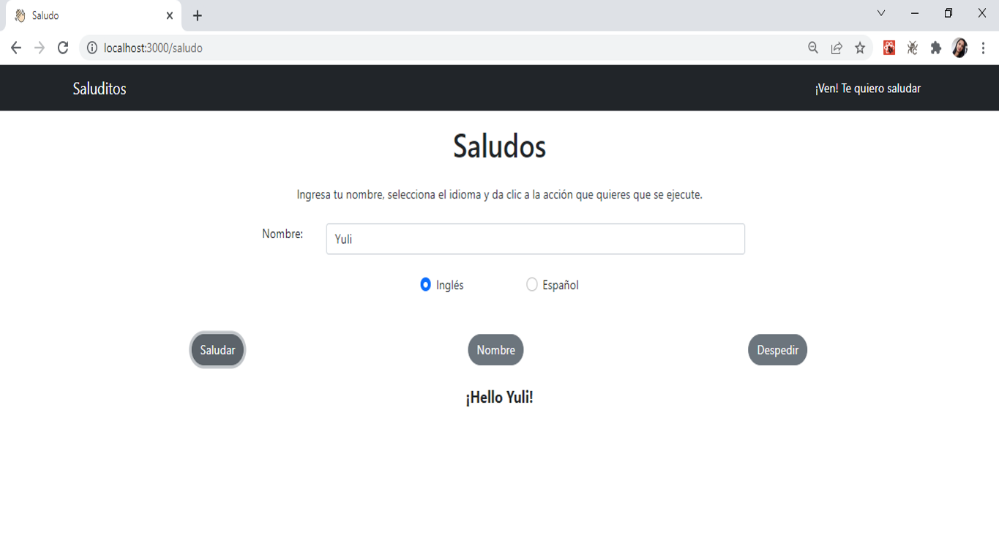
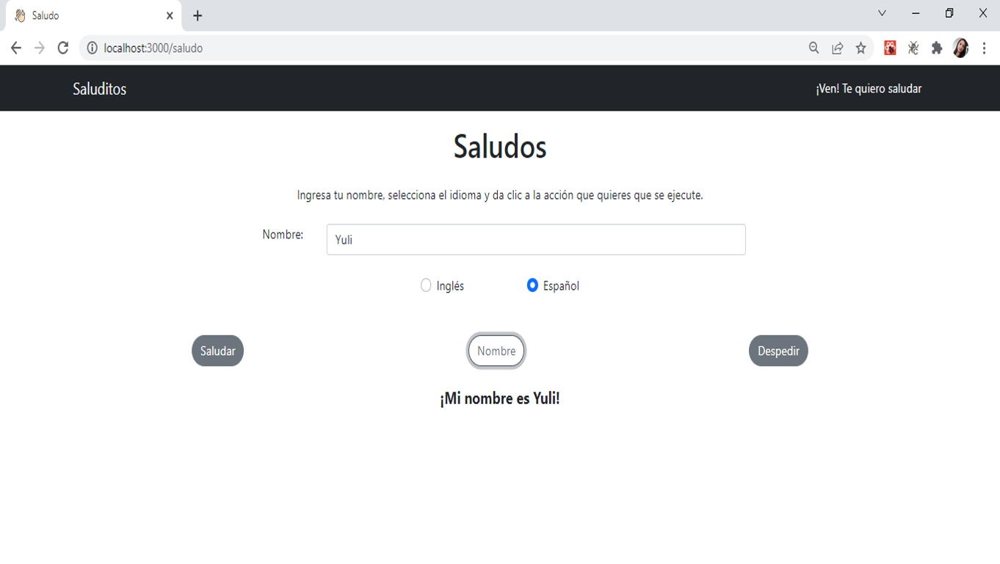
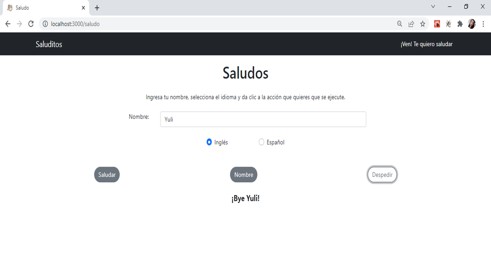
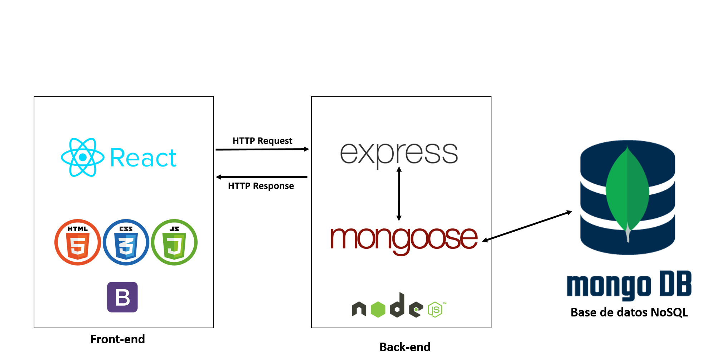

# Coding-test
Este es un sitio web que tiene la capacidad de saludar, decir el nombre del usuario y despedirse según el idioma seleccionado y según el nombre ingresado en un campo de texto.

## Características
### Navegabilidad
El sitio web tiene navegabilidad y puedes desplazarte por la página de inicio y por la página que ejecuta el programa.



### Acciones
Al ingresar a la pestaña "¡Ven! Te voy a saludar" puedes encontrar el programa.

#### Saludar
Al ingresar el nombre, elegir el idioma inglés y la acción de saludar, la página saluda:



#### Nombre
Al ingresar el nombre, elegir el idioma español y la acción de nombre, la página dice tu nombre:



#### Despedir
Al ingresar el nombre, elegir el idioma inglés y la acción de despedir, la página se despide:




## Directorios
En el repositorio puedes encontrar dos directorios:
**Backend**: Encargado de manipular la base de datos.
**Frontend**: Encargado de la parte visual del sitio web y que además trae contenido del backend para ser renderizado.

## Requerimientos
Para correr el programa en una máquina local, debes tener instalado **node**, **npm** y **mongoDB** en tu computador.

## Instrucciones
### Clonar el repositorio
El comando para clonar el repositorio es el siguiente:

```
$ git clone https://github.com/yulyzulu/coding-test.git
```

### Instalación
Necesitarás abrir dos consolas, una para correr el backend y otra para correr el frontend. En cada consola ingresa al respectivo directorio, frontend o backend y escribe el siguiente comando en cada uno:
```
$ npm install
```
Este comando instalará los paquetes necesarios para que el programa pueda correr.

### Crear base de datos
La base de datos fue utilizada para traer los idiomas. Es por eso que para que el programa funcione, debes crear la base de datos ya sea con Postman o Insomnia. Realizarás una petición POST para crear los idiomas, en la ruta:
```
http://localhost:3001/api/languages
```
#### Inglés
Envía un JSON así:
```
{
	"language": "Inglés",
  "greeting": "Hello ",
  "farewell": "Bye ",
  "name": "My name is "
}
```

#### Español
Envía un JSON así:
```
{
	"language": "Español",
  "greeting": "Hola ",
  "farewell": "Chao ",
  "name": "Mi nombre es "
}
```
Ahora estás listo para probar el programa.

## Ejecución
### Ejecución del Backend
Dentro del directorio del backend, ejecuta el siguiente comando:
```
$ npm run dev
```

### Ejecución del Frontend
Dentro del directorio del frontend, ejecuta el siguiente comando:
```
$ npm run start
```

Ahora puedes probar el programa.

## Arquitectura
Este código fue desarrollado con un stack MERN utilizando como lenguaje de programación JavaScript.


### Tecnologías Front-end
#### ReactJs
En la parte del frontend se utilizó la librería de ReactJs. React permite crear interfaces de usuario interactivas de forma sencilla. Es rápido, escalable, flexible, potente y tiene una sólida comunidad de desarrolladores que está creciendo rápidamente.
#### Bootstrap 5
Bootstrap es un framework frontend que permite establecer estilos de una forma sencilla.

### Tecnologías Backend
#### NodeJs
NodeJS es una tecnología que se apoya en el motor de Javascript V8 para permitir la ejecución de programas hechos en Javascript en un ámbito independiente del navegador.

#### Express
Es un marco de applicación web de back-end para NodeJs. Está diseñado para crear apliaciones web y API.

#### MongoDB
MongoDB es un sistema de base de datos NoSQL, orientado a documentos, lo que significa que almacena datos en documentos similares a JSON.

#### Mongoose
Mongoose es una librería para Node.js que nos permite escribir consultas para una base de datos de MongoDB. Su principal uso está en la definición de un esquema donde se indica la configuración de los documentos para una colección de MongoDB.

## Author
Yulieth Zuluaga [Github](https://github.com/yulyzulu) [LinkedIn](https://www.linkedin.com/in/yuliethzuluaga/)